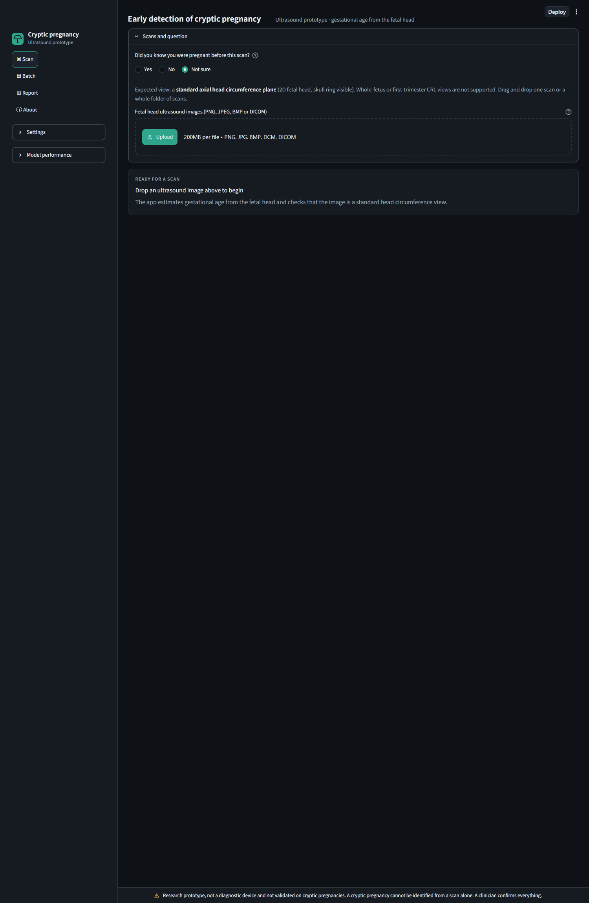
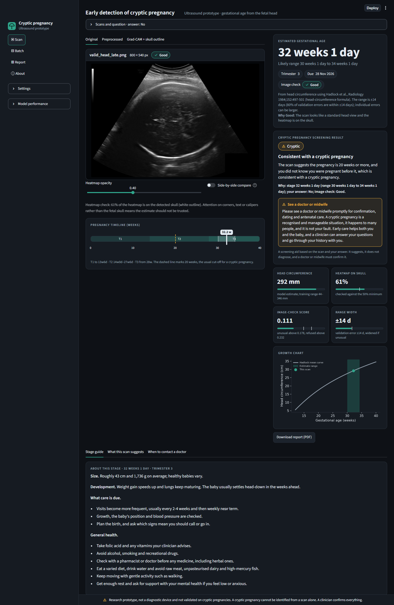
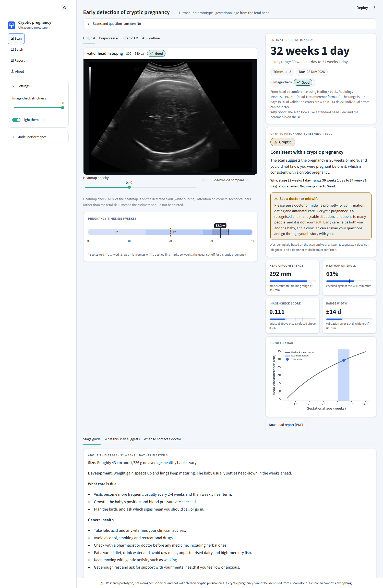
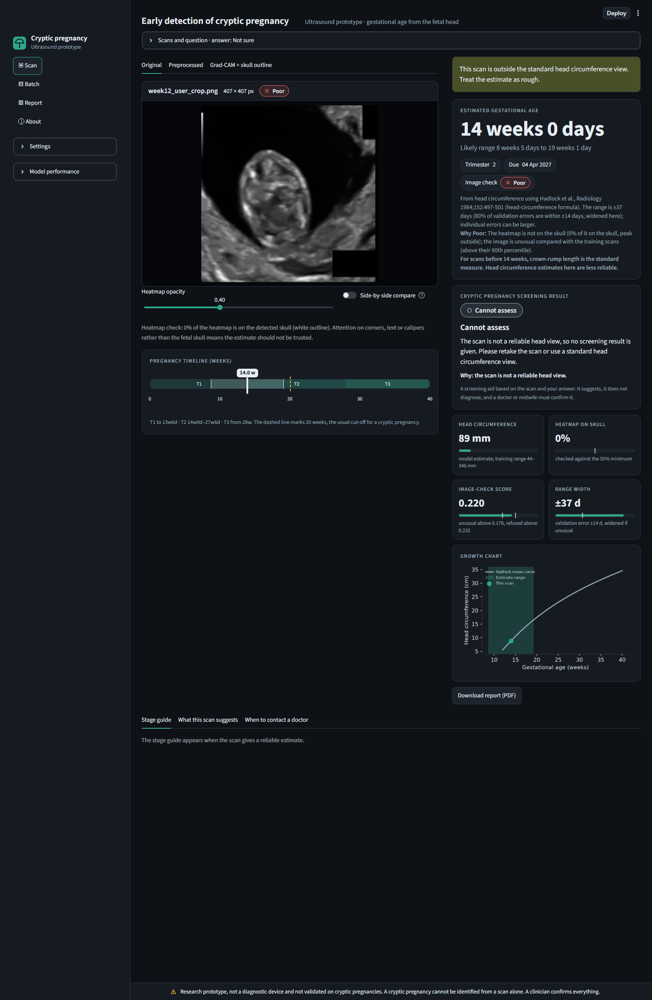
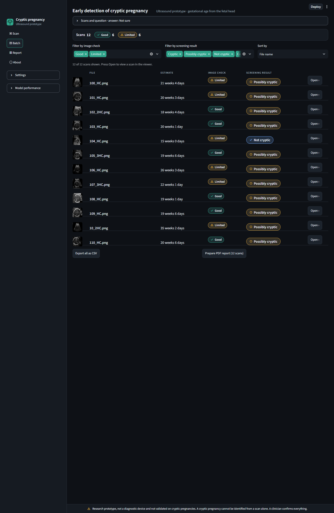
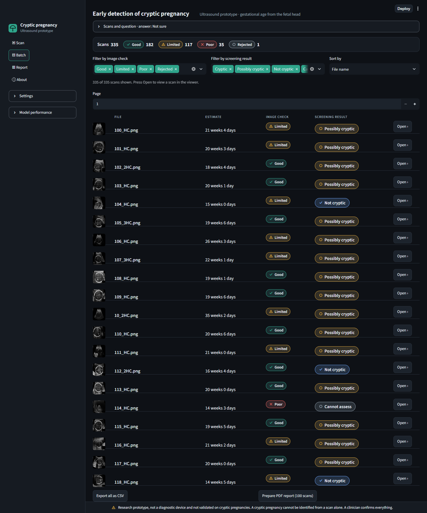
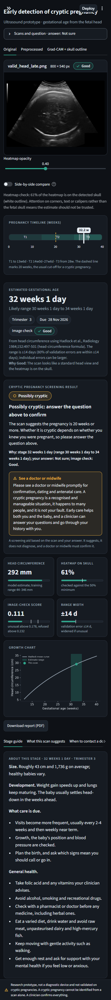

# Early detection of cryptic pregnancy: HC18 model and web app

Implements the pipeline in the GROUP11 research guide (`GROUP11_PRJT302_updated_v2`):
a ResNet50 transfer-learning CNN with Grad-CAM, trained on the HC18 fetal head
ultrasound dataset, plus a Streamlit app that serves it.

**What the model does.** Cryptic pregnancy is a clinical context, not an image class,
and HC18 contains only pregnant scans. Following guide Section 3.4, the model performs
the proxy task: classify a scan's gestational stage (early / mid / late), with labels
binned from head circumference. Head circumference is never a model input (Section 5).

## Setup

```bash
pip install -r requirements.txt
```

Download HC18 from https://zenodo.org/records/1327317 (or hc18.grand-challenge.org) and
unzip `training_set.zip` so the folder holds `000_HC.png`, `000_HC_Annotation.png`, ...
and `training_set_pixel_size_and_HC.csv` (the CSV may also sit next to the folder):

```
data/hc18/training_set/
```

## Train

```bash
python train.py --data data/hc18/training_set --out artifacts
```

Runs on CPU in a few minutes, because the backbone is frozen and features are computed once.
Options: `--thresholds 220 290` sets the early/mid and mid/late cut points in mm
(defaults are the HC values Hadlock's formula maps to about 24 and 32 weeks; the guide
does not give its numbers, so set them to the ones the group used), `--no-denoise`, `--epochs`.

| Guide spec | Where |
|---|---|
| Resize 224×224, 3-channel, normalise, denoise | `hcml/preprocess.py` |
| HC, ellipse area, perimeter, intensity mean/std, entropy | `hcml/data.py`, written to `reports/dataset_features.csv` (descriptive only) |
| Frozen ImageNet ResNet50 → Dense 256 → Dropout 0.5 → softmax | `hcml/model.py` |
| 80/20 test split, 20% of train for validation, early stopping patience 10 on val loss | `train.py` |
| Recall (= sensitivity), accuracy, precision, F1, specificity, FPR, weighted | `reports/metrics.json` |
| Confusion matrix, Grad-CAM on 2 correct and 2 misclassified test images | `reports/*.png` |
| DICOM input via pydicom | `hcml/preprocess.py`, used by the app |

Outputs in `artifacts/`: `model.keras`, `metadata.json`, and `reports/` (metrics,
confusion matrix, training curves, Grad-CAM examples, splits, features).

## Web app

```bash
streamlit run app.py          # loads artifacts/; set MODEL_DIR=... for another folder
```

Upload PNG, JPEG, BMP or DICOM scans and answer one question (did you know you were pregnant before this scan?). For each scan the app shows the
preprocessed image, a Grad-CAM overlay with the detected skull, the estimated gestational age (weeks and
days, likely range, trimester, due date and a growth chart), an image-check badge, a cryptic pregnancy screening result (below), and a short plain-language
"What this scan suggests" paragraph. When the image check is Limited or Poor it shows only a short sentence
saying the estimate is unreliable. Several uploads give a per-image result, an overall average, a CSV and a
PDF report.

## Workstation UI

A dark, calm imaging-workstation layout (light theme in Settings). Left: brand, navigation (Scan, Batch, Report, About),
and collapsible Settings and Model performance. Centre: the viewer (Original / Preprocessed / Grad-CAM with the skull
outline, a caption bar with file name, size and image-check badge, heatmap opacity and a side-by-side compare toggle).
Right: the estimate with range, trimester, due date and image-check chips; the screening result with its badge and
"why" line; four metric tiles (head circumference, heatmap on skull, image-check score, range width) with gauges; and
the growth chart. A 40-week timeline sits under the viewer, with the stage guide below. Status is always icon plus text
(Good, Limited, Poor, Rejected; Cryptic, Possibly cryptic, Not cryptic, Cannot assess), contrast is at least 4.5:1 in both
themes (`tests/test_ui_contrast.py`), images carry alt text, and the disclaimer is pinned in the footer. Code:
`hcml/ui.py` (cards), `hcml/ui.css` (one stylesheet, palettes are CSS variables), `app.py` (pages).

Batch mode analyses with a progress bar, then shows a summary strip with counts per image-check badge and a paged table
(thumbnail, file, estimate, image check, screening result) that can be filtered by badge or result and sorted; "Open"
shows that scan in the viewer. Tested with all 335 scans of the HC18 `test_set`. CSV export and a PDF report (up to 100
scans) are on the Batch and Report pages. The heatmap-opacity slider lives in the viewer toolbar.

Regenerate the screenshots with `python scripts/screenshots.py [--all]` (needs `pip install playwright` and Chrome, with
the app running).

| Empty state | Good scan (late stage, answer "No") |
|---|---|
|  |  |

| Light theme | Poor scan |
|---|---|
|  |  |

| Batch of 12 | Batch of 335 | Mobile |
|---|---|---|
|  |  |  |

## Age estimate (current app)

The model now has two heads on one frozen ResNet50: a **regression head** that predicts head
circumference, converted to gestational age with the Hadlock 1984 head-circumference formula
(Radiology 152:497-501), and the original early/mid/late **classifier** (secondary output). Grad-CAM explains the
regression output. `metadata.json` stores the HC mean/std and the error range shown in the app.

Retrain (needed once after updating, older `artifacts/` have no regression head):

```bash
pip install -r requirements.txt            # adds fpdf2 for the PDF report
python train.py --data ../data/training_set --out artifacts
streamlit run app.py
```

Test metrics are in `artifacts/reports/metrics.json` (`regression`: MAE in days, RMSE, R2,
share within 7/14 days; plus the existing classification metrics) and
`reports/regression_scatter.png`. The "likely range" in the app is the 80th percentile of
validation errors, not a fixed +/-1 week.

### Cryptic pregnancy screening result

The scan is the main evidence; it cannot show whether the person knew about the pregnancy, so the app asks one
question above the upload: "Did you know you were pregnant before this scan?" (Yes / No / Not sure, default Not
sure), plus an optional "weeks when you found out" if Yes. No other history is collected. `hcml/screening.py`
(`screen()`, unit-tested in `tests/test_screening.py`) turns the estimate, its range, the image check and the answer
into one result, using the usual definition (cryptic = not recognised until about 20 weeks or later):

| Situation | Result |
|---|---|
| Image check Poor or estimate withheld | Cannot assess ("the scan is not a reliable head view") |
| Estimate under 20 weeks | Not cryptic by the usual definition |
| 20 weeks or more, answer No | Consistent with a cryptic pregnancy |
| 20 weeks or more, answer Yes | Not cryptic: the pregnancy was known |
| 20 weeks or more, Not sure | Possibly cryptic: answer the question to confirm |
| Image check Limited | every verdict is softened to "May be ..." with the reason |
| Range straddles 20 weeks | "Borderline around 20 weeks", both readings shown |

"Not cryptic" results add stage, trimester, development, usual care and when to contact a doctor;
"Cryptic"/"Possibly cryptic" results add a supportive paragraph urging prompt confirmation, dating and
antenatal care. If the person found out at 20 weeks or later the verdict stays "known" but a note points out
that this late recognition fits the usual definition of cryptic. The wording is "suggests" and "consistent
with", never a diagnosis; the result, answer and reason go into the PDF. It is a research prototype, not
validated on cryptic pregnancies, and a clinician must confirm everything.

### Input check (is this a head-circumference view?)

The regressor always returns a number, so every upload is first checked against the training
scans: the mean cosine distance from its ResNet50 embedding to the 5 nearest training embeddings.
Cut points are calibrated at training time on valid scans never used for fitting (the HC18 test
split plus the unlabeled `test_set` folder next to `training_set`): 95th percentile = "unusual"
(range widened up to 2x), 99.5th percentile = refused (about 0.5% of valid scans). Refused images
get no age and no heatmap, and the app shows a short sentence saying the estimate is unreliable. The user can enter a CRL in mm instead (Robinson & Fleming 1975, 10-84 mm), which is a
manual first-trimester path, not read from the image. Ranges are also widened 1.5x outside 14-36 weeks,
where HC18 is sparse. A hand-built ellipse detector was tried and dropped: it rejected valid HC18
scans and scored a CRL view higher than the typical valid scan.

HC18 holds 1 scan below 12 weeks and 55 between 12 and 13 weeks (by Hadlock age from HC), and
no whole-fetus views at all.

Tests (`python -m pytest tests -q`) cover a valid head view, the week-12 CRL image, a non-ultrasound
photo, DICOM input, unreadable files, the false-rejection rate, the image-check badge and the scan-only
"What this scan suggests" paragraph (shown for a Good image, replaced by a short reliability sentence otherwise).

### Image-check badge (Good / Limited / Poor)

Each accepted scan gets a badge. It drops to **Limited** with one reason and **Poor** with two or more:
the estimate is in the lowest 5% of training ages (under about 13 weeks); the Grad-CAM peak is outside
the detected skull, or under 50% of the heatmap lies on it; no skull-like region is found, or a solid
black box (for example a redaction block) covers part of it; or the embedding distance is above the 90th
percentile of valid scans. A visible warning and a one-line reason are shown. The skull is found by a small
head-localiser (`locator.keras`, trained on HC18 annotation ellipses; test IoU 0.83) whose blob is fitted
with an ellipse. The preprocessing itself never masks the image; black boxes seen in the preview come from
the uploaded file.

Calibration on valid HC18 scans: Grad-CAM puts at least half its weight on the skull in only 60% of test
scans, so the rule downgrades many valid scans (about a third Limited, one in eight Poor). That is a
weakness of the heatmap, kept visible on purpose.

## Known limitations

- **First trimester.** Scans before about 14 weeks are measured by crown-rump length (CRL), not head
  circumference. HC18 has only 1 scan under 12 weeks and no whole-fetus views, so head-circumference
  estimates below 14 weeks are less reliable and may be mis-dated by weeks. The app refuses clearly
  out-of-distribution images and offers a manual CRL entry (Robinson & Fleming 1975); it cannot measure CRL
  from the image.
- Grad-CAM often misses the skull (see above), so treat it as a sanity check, not an explanation.
- Typical age error is about 10 days on valid head views, with a 14-day range.

## Deploy on Render

The trained model files in `artifacts/` are committed, so the app runs as-is. Create a Web Service from the repo:

- Build command: `pip install -r requirements.txt`
- Start command: `streamlit run app.py --server.port $PORT --server.address 0.0.0.0 --server.headless true`
- Python 3.11 is pinned by `.python-version` (TensorFlow does not support the newest Python releases).
- Use a plan with at least 2 GB of RAM; TensorFlow plus ResNet50 will not fit in 512 MB.

Developer tools (pytest, playwright for the screenshots) are in `requirements-dev.txt`.

## Smoke test without HC18

```bash
python scripts/make_synthetic_hc18.py --out data/synthetic/training_set --n 150
python train.py --data data/synthetic/training_set --out artifacts_smoke
MODEL_DIR=artifacts_smoke streamlit run app.py
```

The synthetic images are drawn ellipses, only for checking the code runs. Do not report results from them.

## Limits (from the guide)

Proxy task only; single-centre data; no patient IDs, so repeat scans may cross splits;
not validated on non-pregnant or cryptic pregnancy cases. The two-class "pregnancy finding
present / absent" model (Section 8.1) needs source-matched non-pregnant scans.
